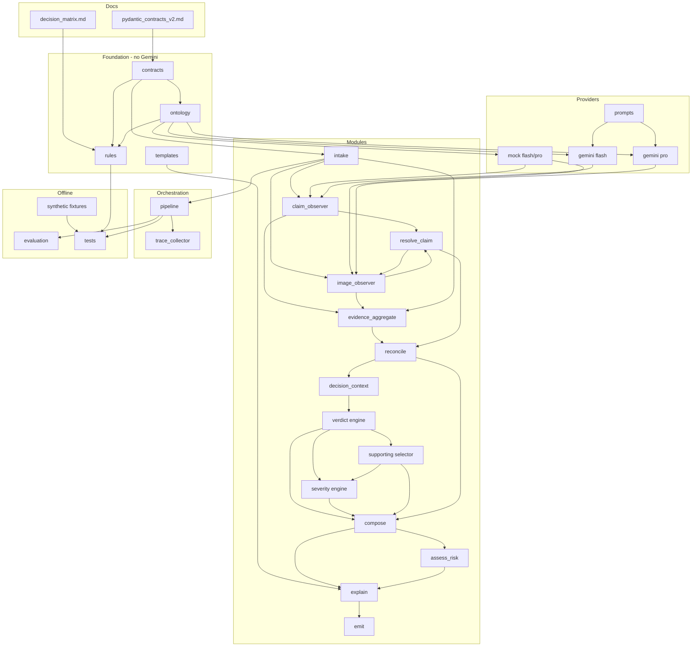

# Project Structure

**Status:** Canonical repository layout for implementation  
**Aligns with:** [architecture_v2.md](architecture_v2.md), [pydantic_contracts_v2.md](pydantic_contracts_v2.md), [decision_matrix.md](decision_matrix.md), [AGENTS.md](../AGENTS.md) §6

This document defines the complete repository structure. No implementation code is specified here — only directories, module boundaries, contracts, and build order.

---

## 1. Complete Repository Structure

```text
multimodal-claim-review-system/
│
├── AGENTS.md                          # Agent rules + submission contract (do not move)
├── README.md                          # Top-level hackathon readme
├── problem_statement.md               # I/O schema (read-only reference)
├── output.csv                         # Generated predictions (repo root per README)
│
├── dataset/                           # Provided data (read-only in production runs)
│   ├── sample_claims.csv
│   ├── claims.csv
│   ├── user_history.csv
│   ├── evidence_requirements.csv
│   └── images/
│       ├── sample/
│       └── test/
│
├── docs/                              # Design authority (read-only during CI)
│   ├── problem_decomposition.md
│   ├── architecture_v2.md
│   ├── architecture_review.md
│   ├── decision_matrix.md
│   ├── pydantic_contracts_v2.md
│   ├── project_structure.md           # This file
│   ├── architect_prompt.md
│   └── ds/                            # Data Scientist Mode artifacts
│       ├── label_analysis.md
│       ├── hidden_business_rules.md
│       ├── hypotheses.md
│       ├── class_balance.md
│       └── failure_taxonomy.md
│
└── code/                              # All implementation lives here (AGENTS.md §6)
    ├── README.md                      # How to run, env vars, architecture summary
    ├── pyproject.toml                 # Or requirements.txt — dependencies + version
    ├── main.py                        # Entry point: claims.csv → output.csv
    │
    ├── config/
    │   ├── pipeline.yaml              # pipeline_version, feature flags
    │   └── settings.py                # Env var loading (GEMINI_API_KEY, paths)
    │
    ├── contracts/                     # TYPED CONTRACTS (Pydantic models)
    │   ├── __init__.py
    │   ├── primitives.py              # ConfidenceLevel, ScoredField, RuleId
    │   ├── enums.py                   # ClaimStatus, IssueType, ObjectPart, RiskFlag
    │   ├── intake.py                  # ClaimContext
    │   ├── observation.py             # ClaimObservation, ImageEvidence
    │   ├── resolution.py              # ClaimResolutionContext, EvidenceContext
    │   ├── reconciliation.py          # ConsistencyContext, ValidationContext, TrustAssessmentContext
    │   ├── decision.py                # DecisionContext, VerdictDecision, SeverityDecision,
    │   │                              # SupportingImageDecision, ClaimDecision
    │   ├── risk.py                    # RiskContext
    │   ├── trace.py                   # DecisionTrace, RuleHit
    │   └── evaluation.py              # EvaluationRecord, EngineScoreBundle, OutputRowSnapshot
    │
    ├── ontology/                      # ONTOLOGY (closed vocabularies + validators)
    │   ├── __init__.py
    │   ├── object_parts.py            # Per-claim_object part sets
    │   ├── issue_types.py
    │   ├── issue_families.py          # IssueFamily ↔ RequirementId mapping
    │   ├── risk_flags.py
    │   └── normalize.py               # Map unknown model output → unknown enum
    │
    ├── rules/                         # DETERMINISTIC RULES (no model calls)
    │   ├── __init__.py
    │   ├── predicates.py                # PART_CLEAR, IDENTITY_CONFLICT, etc.
    │   ├── resolve_claim.py           # MP-1..MP-5 → ClaimResolutionContext
    │   ├── consistency.py             # ConsistencyContext
    │   ├── sufficiency.py             # ESM-R01..R08 → ValidationContext
    │   ├── trust.py                   # VI-R01..R04 → TrustAssessmentContext
    │   ├── verdict.py                 # CS-R01..R08 → VerdictDecision
    │   ├── severity.py                # SV-R01..SV-R08 → SeverityDecision
    │   ├── supporting_images.py       # SI-R01..R07 → SupportingImageDecision
    │   ├── risk.py                    # Risk flags + MRR-1..MRR-6 → RiskContext
    │   ├── compose.py                 # ComposeClaimDecision (validation only)
    │   └── requirements_map.py        # IssueFamily → REQ_* IDs
    │
    ├── prompts/                       # PROMPT TEMPLATES (versioned text)
    │   ├── claim/
    │   │   ├── v1/
    │   │   │   ├── system.txt
    │   │   │   ├── user_template.txt
    │   │   │   └── schema.json        # Expected JSON shape for Flash
    │   │   └── v2/                    # A/B strategy slot
    │   └── vision/
    │       ├── v1/
    │       │   ├── system.txt
    │       │   ├── user_template.txt
    │       │   └── schema.json        # Expected JSON shape for Pro
    │       └── v2/
    │
    ├── providers/                     # MODEL PROVIDERS (Gemini adapters)
    │   ├── __init__.py
    │   ├── base.py                    # ObserverProvider protocol
    │   ├── gemini_flash.py            # ClaimObserver adapter
    │   ├── gemini_pro.py              # ImageObserver adapter
    │   ├── rate_limit.py              # TPM/RPM throttle, retry
    │   ├── cache.py                   # Optional response cache keyed by hash
    │   └── mock/                      # Non-Gemini stubs for tests
    │       ├── flash_stub.py
    │       └── pro_stub.py
    │
    ├── modules/                       # PIPELINE MODULES (business logic units)
    │   ├── __init__.py
    │   ├── intake.py                  # M1
    │   ├── claim_observer.py          # M2a
    │   ├── image_observer.py          # M2b
    │   ├── resolve_claim.py           # M3
    │   ├── evidence_aggregate.py      # M4
    │   ├── reconcile.py               # M5 (facade → consistency, sufficiency, trust)
    │   ├── decision_context.py        # M6
    │   ├── claim_decision_engine.py   # M7a
    │   ├── severity_engine.py         # M7b
    │   ├── supporting_image_selector.py # M7c
    │   ├── compose_claim_decision.py  # M8
    │   ├── assess_risk.py             # M9
    │   ├── explain.py                 # M10
    │   └── emit.py                    # M11
    │
    ├── orchestration/                 # ORCHESTRATION (wiring only, no rules)
    │   ├── __init__.py
    │   ├── pipeline.py                # RowProcessor: single claim end-to-end
    │   ├── batch_runner.py            # claims.csv batch + parallelism
    │   ├── trace_collector.py         # M13 DecisionTrace assembly
    │   └── stages.py                  # Stage enum + execution order guard
    │
    ├── templates/                     # EXPLAINABILITY (prose templates)
    │   ├── esm_reasons.yaml           # evidence_standard_met_reason keys
    │   ├── justifications.yaml        # claim_status_justification keys
    │   └── render.py                  # Fill templates from rule outputs
    │
    ├── evaluation/                    # EVALUATION (offline, AGENTS.md entry point)
    │   ├── main.py                    # Suggested evaluator entry point
    │   ├── runner.py                  # M12 EvaluationHarness
    │   ├── metrics.py                 # Per-engine + weighted scores
    │   ├── compare_strategies.py      # A/B prompt or rule versions
    │   ├── operational_report.py      # Token/cost/latency aggregation
    │   └── evaluation_report.md       # Generated report (submission artifact)
    │
    ├── synthetic/                     # SYNTHETIC DATASETS (fixtures beyond sample)
    │   ├── README.md
    │   ├── generate_fixtures.py       # Build DecisionContext JSON from rules
    │   └── fixtures/
    │       ├── observations/          # Frozen ClaimObservation + ImageEvidence
    │       ├── decision_contexts/     # Per failure-class DecisionContext
    │       └── multi_part/            # Synthetic multi-part claim rows
    │
    └── tests/                         # TESTING
        ├── __init__.py
        ├── conftest.py                  # Shared fixtures, mock providers
        ├── contracts/                   # Pydantic validation tests
        ├── ontology/
        ├── rules/                       # Unit tests per rule module
        │   ├── test_sufficiency.py
        │   ├── test_verdict.py
        │   ├── test_severity.py
        │   ├── test_supporting_images.py
        │   └── test_risk.py
        ├── modules/                     # Module integration with mock providers
        ├── orchestration/             # Pipeline order + stage guards
        ├── golden/                      # Full row traces vs sample_claims.csv
        │   └── sample_rows/             # One JSON trace per sample user_id
        └── evaluation/                  # Eval harness smoke tests
```

### Output artifacts (generated at runtime)

| Path | Producer |
|------|----------|
| `output.csv` (repo root) | `modules/emit.py` via `main.py` |
| `code/evaluation/evaluation_report.md` | `evaluation/operational_report.py` |
| `code/.cache/` (gitignored) | `providers/cache.py` |
| `code/.traces/` (gitignored, optional) | `orchestration/trace_collector.py` |

---

## 2. Module → Contract Mapping

| Module path | Consumes | Produces |
|-------------|----------|----------|
| **M1** `modules/intake.py` | CSV rows, `user_history.csv`, `evidence_requirements.csv`, image paths | `ClaimContext` |
| **M2a** `modules/claim_observer.py` | `ClaimContext` | `ClaimObservation` |
| **M2b** `modules/image_observer.py` | `ClaimContext`, `ClaimObservation` (pass 1), `ClaimResolutionContext` (pass 2) | `list[ImageEvidence]` |
| **M3** `modules/resolve_claim.py` | `ClaimContext`, `ClaimObservation`, `list[ImageEvidence]` | `ClaimResolutionContext` |
| **M4** `modules/evidence_aggregate.py` | `ClaimContext`, `ClaimObservation`, `list[ImageEvidence]` | `EvidenceContext` |
| **M5a** `rules/consistency.py` | `EvidenceContext`, `ClaimResolutionContext` | `ConsistencyContext` |
| **M5b** `rules/sufficiency.py` | `EvidenceContext`, `ClaimResolutionContext`, `ConsistencyContext` | `ValidationContext` |
| **M5c** `rules/trust.py` | `EvidenceContext`, `ClaimResolutionContext` | `TrustAssessmentContext` |
| **M5** `modules/reconcile.py` | `EvidenceContext`, `ClaimResolutionContext` | `ConsistencyContext`, `ValidationContext`, `TrustAssessmentContext` |
| **M6** `modules/decision_context.py` | `ClaimContext`, `ClaimObservation`, `ClaimResolutionContext`, `list[ImageEvidence]`, reconciliation contexts | `DecisionContext` |
| **M7a** `modules/claim_decision_engine.py` | `DecisionContext` | `VerdictDecision` |
| **M7b** `modules/severity_engine.py` | `DecisionContext`, `VerdictDecision`, `SupportingImageDecision` (optional extent) | `SeverityDecision` |
| **M7c** `modules/supporting_image_selector.py` | `DecisionContext`, `VerdictDecision` | `SupportingImageDecision` |
| **M8** `modules/compose_claim_decision.py` | `VerdictDecision`, `SeverityDecision`, `SupportingImageDecision`, `ValidationContext`, `TrustAssessmentContext` | `ClaimDecision` |
| **M9** `modules/assess_risk.py` | `ClaimContext`, `ClaimDecision`, `EvidenceContext`, `ConsistencyContext`, `VerdictDecision` | `RiskContext` |
| **M10** `modules/explain.py` | `ClaimDecision`, `RiskContext`, `ValidationContext`, rule hits | `ClaimDecision` (prose fields filled) |
| **M11** `modules/emit.py` | `ClaimContext`, `ClaimDecision`, `RiskContext` | CSV row dict |
| **M12** `evaluation/runner.py` | `sample_claims.csv`, pipeline outputs | `list[EvaluationRecord]` |
| **M13** `orchestration/trace_collector.py` | All stage outputs | `DecisionTrace` |

### Provider adapters (not pipeline modules)

| Provider | Consumes | Produces (raw → normalized) |
|----------|----------|----------------------------|
| `providers/gemini_flash.py` | `ClaimContext`, prompt vN | JSON → `ClaimObservation` via `ontology/normalize` |
| `providers/gemini_pro.py` | `ClaimContext`, image file, prompt vN, optional `ClaimResolutionContext` | JSON → `ImageEvidence` |
| `providers/mock/flash_stub.py` | `ClaimContext` | `ClaimObservation` from fixtures |
| `providers/mock/pro_stub.py` | `ClaimContext`, fixture path | `ImageEvidence` from fixtures |

---

## 3. Layer Separation

| Layer | Directory | Responsibility | Must not contain |
|-------|-----------|----------------|------------------|
| **Orchestration** | `orchestration/` | Stage order, batching, trace assembly | Business rules, prompts, model API calls |
| **Contracts** | `contracts/` | Pydantic models, validation | Logic, I/O |
| **Providers** | `providers/` | External model I/O, retry, cache | Verdict rules, CSV parsing |
| **Prompts** | `prompts/` | Versioned prompt text + JSON schemas | Python logic |
| **Ontology** | `ontology/` | Enum sets, normalization, requirement maps | Model calls |
| **Rules** | `rules/` | Deterministic decision_matrix implementation | Gemini imports |
| **Modules** | `modules/` | Thin facades wiring providers + rules | Duplicated rule logic |
| **Templates** | `templates/` | Prose template files | Decisions |
| **Evaluation** | `evaluation/` | Metrics, reports, strategy compare | Production hot path |
| **Synthetic** | `synthetic/` | Fixture generation for gaps in sample | Production data |
| **Testing** | `tests/` | pytest suites | Production code imports from tests |

---

## 4. Implementation Order

Build bottom-up: contracts and rules before providers; providers before orchestration.

| Phase | Deliverable | Depends on |
|-------|-------------|------------|
| **P0** | `contracts/`, `ontology/` | `docs/pydantic_contracts_v2.md` |
| **P1** | `rules/predicates.py`, `rules/requirements_map.py` | P0 |
| **P2** | `rules/resolve_claim.py`, `rules/consistency.py`, `rules/sufficiency.py`, `rules/trust.py` | P1 |
| **P3** | `rules/verdict.py`, `rules/severity.py`, `rules/supporting_images.py`, `rules/risk.py`, `rules/compose.py` | P2 |
| **P4** | `templates/`, `rules` + `templates` integration tests | P3 |
| **P5** | `providers/mock/`, `modules/intake.py` through `modules/decision_context.py` | P0–P2 |
| **P6** | `modules/claim_decision_engine.py`, `severity_engine.py`, `supporting_image_selector.py`, `compose_claim_decision.py`, `assess_risk.py`, `explain.py`, `emit.py` | P3–P5 |
| **P7** | `orchestration/pipeline.py` + `main.py` (mock providers only) | P5–P6 |
| **P8** | `prompts/`, `providers/gemini_*.py`, wire M2a/M2b | P7 |
| **P9** | `evaluation/`, `synthetic/fixtures/` | P7 |
| **P10** | `orchestration/batch_runner.py`, cache, rate limit, operational report | P8–P9 |

---

## 5. Testing Order

| Order | Test suite | Validates |
|-------|------------|-----------|
| **T1** | `tests/contracts/` | All Pydantic models reject invalid enums |
| **T2** | `tests/ontology/` | Normalization, part sets per object |
| **T3** | `tests/rules/test_*.py` | Each rule ID against `synthetic/fixtures/decision_contexts/` |
| **T4** | `tests/modules/` (mock providers) | Module consume/produce contracts |
| **T5** | `tests/orchestration/` | Stage order violations fail fast |
| **T6** | `tests/golden/sample_rows/` | End-to-end vs `sample_claims.csv` (mock observations first) |
| **T7** | `tests/golden/` (live Gemini, optional CI flag) | Observation quality smoke |
| **T8** | `tests/evaluation/` | Harness metrics match hand-computed scores |

**Gate:** T1–T6 must pass before enabling Gemini in CI. T7 required before submission.

---

## 6. Evaluation Order

| Step | Action | Input | Output |
|------|--------|-------|--------|
| **E1** | Rule-only eval | `synthetic/fixtures/observations/` | Per-engine accuracy (no API cost) |
| **E2** | Sample mock pipeline | `sample_claims.csv` + mock providers | `EvaluationRecord` baseline |
| **E3** | Strategy A | `prompts/*/v1` + Gemini | Metrics + traces |
| **E4** | Strategy B | `prompts/*/v2` or rule tweak | Metrics + traces |
| **E5** | Compare | E3 vs E4 | `evaluation/compare_strategies.py` report |
| **E6** | Select winner | Best weighted score | Document in `evaluation_report.md` |
| **E7** | Test inference | `claims.csv` | `output.csv` |
| **E8** | Operational analysis | E7 run logs | Token/cost/latency in `evaluation_report.md` |

Weighted score per [architecture_v2.md](architecture_v2.md) §6 and Data Scientist `class_balance.md`.

---

## 7. Minimum Viable Pipeline (MVP)

Goal: Evaluable `output.csv` on `sample_claims.csv` with **mock observations** and **full deterministic rules**.

### MVP includes

| Component | MVP scope |
|-----------|-----------|
| `contracts/` | All v2 models |
| `ontology/` | Full enum validation |
| `rules/` | All matrices from decision_matrix.md |
| `providers/mock/` | Flash + Pro stubs loaded from `synthetic/fixtures/observations/` |
| `modules/` | M1–M11 (all modules) |
| `orchestration/pipeline.py` | Single-row processor, correct stage order |
| `main.py` | Read `claims.csv`, write `output.csv` |
| `templates/` | ESM + justification templates for sample coverage |
| `tests/rules/` + `tests/golden/` (mock) | 20 sample rows |
| `evaluation/main.py` | Field accuracy on sample only |

### MVP excludes

| Component | Deferred |
|-----------|----------|
| Live Gemini providers | Use mocks |
| `providers/cache.py`, `rate_limit.py` | Optional |
| `prompts/v2` A/B | Single mock path |
| `synthetic/generate_fixtures.py` | Hand-written fixtures only |
| Image pass-2 | Can default pass-1 scores if `multi_part_claim=false` only in MVP |
| `docs/ds/*` complete | Minimum hidden rules doc |
| Operational cost report | Placeholder counts |

### MVP exit criteria

- 20/20 `sample_claims.csv` rows match on `claim_status` + `evidence_standard_met` with frozen mock observations.
- HR-01..HR-03 enforced by tests.
- `output.csv` schema validates against `problem_statement.md`.

---

## 8. Competition-Grade Pipeline

Goal: Submission-ready system with live Gemini, A/B evaluation, audit traces, and test inference.

### Additional components beyond MVP

| Component | Competition requirement |
|-----------|-------------------------|
| `providers/gemini_flash.py` + `gemini_pro.py` | Constitution model policy |
| `prompts/claim/v1` + `prompts/vision/v1` | Production prompts |
| `prompts/*/v2` | Second strategy for README/eval |
| `providers/rate_limit.py` + `cache.py` | TPM/RPM + cost control |
| Image pass-2 | `multi_part_claim=true` rows |
| `orchestration/batch_runner.py` | 44 test rows + parallelism |
| `orchestration/trace_collector.py` | Full `DecisionTrace` per row |
| `evaluation/operational_report.md` | Model calls, tokens, cost, latency |
| `evaluation/compare_strategies.py` | Document final strategy |
| `docs/ds/*` | All five Data Scientist artifacts |
| `tests/golden/` live smoke | Subset with real Gemini |
| `code/README.md` | Run instructions, env vars |
| `synthetic/multi_part/` | Fixtures for test-set multi-part pattern |

### Competition exit criteria

- Weighted evaluation score maximized on `sample_claims.csv`.
- `output.csv` = 44 rows, exact column order.
- `evaluation/` included in `code.zip`.
- No hardcoded test labels.
- Secrets from env vars only.

---

## 9. Gemini vs Non-Gemini Modules

### No Gemini required (implement and test first)

| Module / layer | Reason |
|----------------|--------|
| `contracts/` | Pure types |
| `ontology/` | Pure validation |
| `rules/*` | decision_matrix.md is deterministic |
| `templates/` | Static YAML |
| `modules/intake.py` | CSV + file I/O |
| `modules/resolve_claim.py` | Rules only |
| `modules/evidence_aggregate.py` | Aggregation |
| `modules/reconcile.py` | Delegates to rules |
| `modules/decision_context.py` | Aggregation |
| `modules/claim_decision_engine.py` | Rules only |
| `modules/severity_engine.py` | Rules only |
| `modules/supporting_image_selector.py` | Rules only |
| `modules/compose_claim_decision.py` | Validation + merge |
| `modules/assess_risk.py` | Rules + history CSV |
| `modules/explain.py` | Templates |
| `modules/emit.py` | CSV writer |
| `orchestration/*` | Wiring |
| `evaluation/metrics.py` | Math on records |
| `providers/mock/*` | Test doubles |
| `synthetic/fixtures/*` | Hand-authored JSON |

### Gemini required

| Module | Model | Purpose |
|--------|-------|---------|
| `providers/gemini_flash.py` | Gemini 2.5 Flash | `ClaimObservation` from chat |
| `providers/gemini_pro.py` | Gemini 2.5 Pro | `ImageEvidence` per image |
| `modules/claim_observer.py` | (via Flash provider) | M2a facade |
| `modules/image_observer.py` | (via Pro provider) | M2b facade |

**Note:** MVP can ship with `providers/mock` only. Competition submission requires live Gemini for test `claims.csv` unless observations are pre-materialized (not recommended — breaks reproducibility).

---

## 10. Dependency Graph



### Hard dependency rules

1. `rules/` must not import `providers/`.
2. `contracts/` must not import `modules/`, `rules/`, or `providers/`.
3. `M7b` and `M7c` must not run before `M7a`.
4. `M9` must not run before `M8`.
5. `M9` must not feed back into `M7a`–`M7c`.

---

## 11. Anti-Patterns

| Anti-pattern | Why forbidden | Correct location |
|--------------|---------------|------------------|
| Verdict logic in `providers/gemini_*.py` | Violates Models Observe / Rules Decide | `rules/verdict.py` |
| `claim_status` in `ClaimObservation` | Observation contract pollution | `VerdictDecision` |
| Single `decide.py` merging M7a–M7c | v2 explicitly split engines | Three modules + compose |
| Raw `dict` between modules | pydantic_contracts_v2 purpose | `contracts/` models |
| Prompt text inline in Python | No versioning / A/B | `prompts/` |
| Enum strings scattered in rules | Ontology drift | `ontology/` |
| Risk flags influencing verdict | HR-05, constitution | `assess_risk` after compose |
| `claimed_severity_language` → `severity` | SV-R01..SV-R08 use visible extent only | `SeverityDecision` from images |
| Hardcoded answers per `user_id` | Submission disqualification | General rules only |
| Gemini in `tests/rules/` | Rules must be deterministic offline | `providers/mock` |
| Business logic in `main.py` | Untestable entry point | `orchestration/pipeline.py` |
| Secrets in repo | AGENTS.md §6.2 | Env vars + `.env` gitignored |

---

## 12. Future Extensibility

| Extension | Hook point | Notes |
|-----------|------------|-------|
| New prompt strategy | `prompts/claim/vN`, `prompts/vision/vN` | Register in `config/pipeline.yaml` |
| Alternative VLM | New file under `providers/` implementing `ObserverProvider` | Do not change `modules/` |
| New `RiskFlag` value | Requires problem_statement change — use `unknown` until then | `ontology/risk_flags.py` |
| Caching layer | `providers/cache.py` wraps provider calls | Key = image hash + prompt version |
| Parallel batch | `orchestration/batch_runner.py` | Row-level isolation; shared rate limit |
| Human review UI | Consume `DecisionTrace` JSON from `.traces/` | Out of scope for hackathon |
| Additional languages | `ClaimObservation.detected_languages` + prompt tuning | No schema change |
| Confidence calibration | `providers/` post-process scores | Rules unchanged |
| Rule matrix v2 | `rules/*` + bump `pipeline_version` | Replay `synthetic/` fixtures |
| Precomputed observations | Optional `providers/fixture_replay.py` | For CI without API keys |

### Versioning strategy

| Artifact | Version field |
|----------|---------------|
| Contracts + rules | `ClaimContext.pipeline_version` |
| Flash prompts | `ClaimObservation.prompt_version` |
| Vision prompts | `ImageEvidence.prompt_version` |
| Traces | `DecisionTrace.contracts_version = "2.0"` |

---

## 13. AGENTS.md Contract Compliance

| AGENTS.md requirement | Project structure mapping |
|-----------------------|---------------------------|
| Entry point `code/main.py` | `code/main.py` → `orchestration/batch_runner.py` |
| Entry point `code/evaluation/main.py` | `code/evaluation/main.py` |
| Output `output.csv` | Written to repo root by `modules/emit.py` |
| `evaluation/` in submission zip | `code/evaluation/` |
| Secrets via env | `config/settings.py` reads `GEMINI_API_KEY` etc. |
| Deterministic where possible | All of `rules/` + template explain |
| README in `code/` | `code/README.md` |

---

## 14. Document Cross-Reference

| Question | Read |
|----------|------|
| What to build | [problem_decomposition.md](problem_decomposition.md) |
| Module boundaries | [architecture_v2.md](architecture_v2.md) |
| Rule logic | [decision_matrix.md](decision_matrix.md) |
| Type definitions | [pydantic_contracts_v2.md](pydantic_contracts_v2.md) |
| Where files go | **This document** |
| Label / metric strategy | `docs/ds/` |
